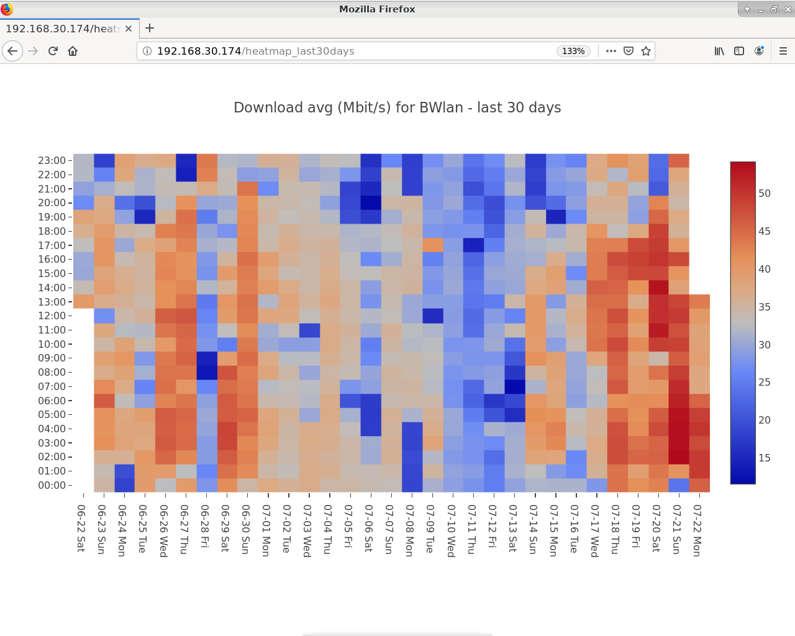
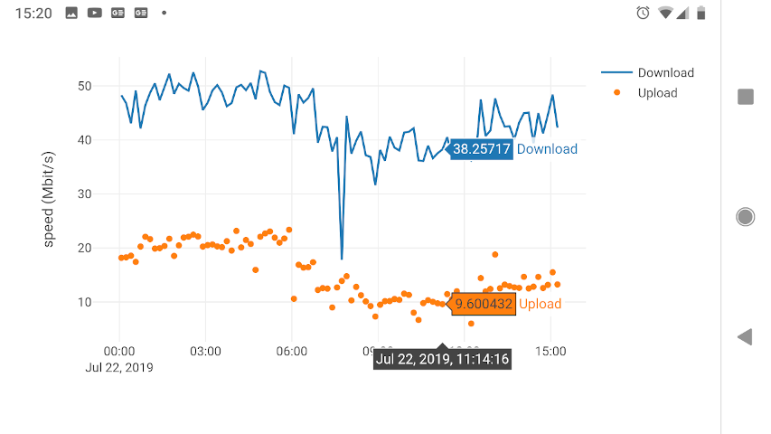

speedtest_http
==============

Visualize data generated by
`speedtest-cli <https://github.com/sivel/speedtest-cli>`_ in a web app
powered by `Plotly <https://plot.ly/python/>`_

.. image:: https://img.shields.io/pypi/v/speedtest-http.svg
        :target: https://pypi.python.org/pypi/speedtest-http/
        :alt: Latest Version
.. image:: https://img.shields.io/travis/shuntingyard/speedtest-http.svg
        :target: https://pypi.python.org/pypi/speedtest-http/
        :alt: Travis
.. image:: https://img.shields.io/pypi/l/speedtest-http.svg
        :target: http://github.com/shuntingyard/speedtest_http/blob/master/LICENSE.txt 
        :alt: License
.. image:: https://img.shields.io/docker/cloud/build/shuntingyard/speedtest_http.svg
        :target: https://cloud.docker.com/repository/docker/shuntingyard/speedtest_http/
        :alt: Docker Image
.. image:: https://img.shields.io/pypi/pyversions/speedtest-http.svg
        :target: https://pypi.python.org/pypi/speedtest-http/
        :alt: Versions

Screenshots
-----------

Desktop
~~~~~~~

Android
~~~~~~~

Description
-----------

Web app for visualizing internet uplink speeds. Environments supported so far:

- Docker container
- GNU/Linux hosts with Python >= 3.6 installed

(Other POSIX systems and Windows need testing.)

Recent changes
--------------

- technical, dash removed, all graphs powered by pure plotly now

Installation
------------

dockerhub
~~~~~~~~~

::

   docker pull shuntingyard/speedtest_http

   # Please adapt port, volumes and env variables according to your needs.

   docker run -d -p 80:5000 -v ~/data:/data -e "TZ=EST" \
      -e "INFILE=/data/speedtest.csv" -e "SITENAME=my provider" \
      shuntingyard/speedtest_http

pip / easy\_install
~~~~~~~~~~~~~~~~~~~

::

   pip install speedtest_http

or

::

   easy_install speedtest_http

Github
~~~~~~

::

   pip install git+https://github.com/shuntingyard/speedtest_http.git

or

::

   git clone https://github.com/shuntingyard/speedtest_http.git
   cd speedtest_http
   python setup.py install

run in shell environments
~~~~~~~~~~~~~~~~~~~~~~~~~

::

   # Please adapt env variables, host, port according to your needs.

   INFILE=~/data/speedtest.csv \
   LOGDIR=/tmp \
   SITENAME="my provider" \
   FLASK_APP=speedtest_http \
   FLASK_DEBUG=0 \
   python -m flask run -h 0.0.0.0 -p 8080

Changelog
---------

Version 0.0.4
~~~~~~~~~~~~~

- Using new `speedtest_reader <https://pypi.org/project/speedtest-reader/>`_ API
  
Version 0.0.3
~~~~~~~~~~~~~

- All graphs migrated from Dash to Plotly
